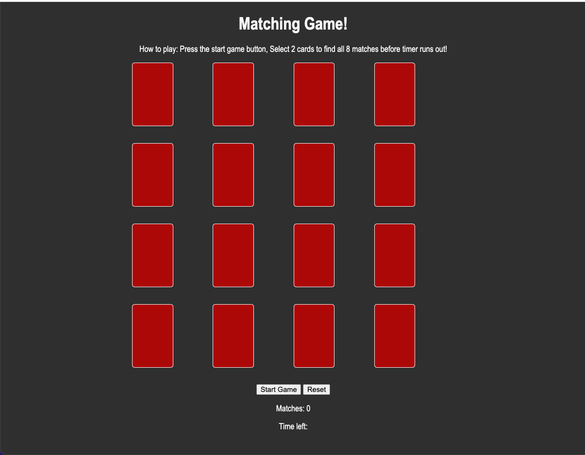

# matching game

My game is a number matching game, with 8 matches to get and a timer of 1:30.
If you get all 8 matches in 1:30, you win! If not, you lose, try again!

I chose this game because my daughter loves games and I thought it would be cool for her to be able to play a game I built. We took turns as if it was a 2 player game and we had fun! Also, it seemed like quite a challenge, but not too challenging for me to be lost the whole time. It was much harder than I was expecting though. I enjoyed making this game.

Links to attributions: sites I used to help build my game. Not sure if this is what this section means..

https://stackoverflow.com/questions/20618355/how-to-write-a-countdown-timer-in-javascript
https://www.youtube.com/watch?v=xWdkt6KSirw&t=449s
https://www.youtube.com/watch?v=wz9jeI9M9hI
https://marketplace.visualstudio.com/items?itemName=mushan.vscode-paste-image

Technologies used:
HTML
CSS
JavaScript
gitHub
Youtube
webmdn
stackoverflow

For my future enhancments I would like to when you push the start button, the timer would count correctly. Also, when you click near a card, but not on it, it acts a little wierd. Not sure how you could fix that at my level of experience..Add pictures onto the cards instead of just numbers.